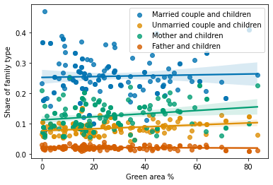

Green areas are found to have a positive effect on well-being, whether it is physical, mental or social. It is important that people would have access to green areas in a manner that serves their needs. Our project on the greenspaces and residential segregation in Helsinki analyzed whether the amount and distribution of green areas within Helsinki could have an effect on social segregation. 

*Districts of Helsinki and the percentages of green area in them.*

## Important part of urban planning

Considering the optimal balance between greenspaces and built-up areas will enable better urban planning and city development. The original target of the project was to find results that could be of aid for different stakeholders in urban development, mainly for municipal decision makers. The intention was to produce a model that could be used as a tool for zoning and land-use planning. 

The project studied the districts of Helsinki: the amount of green space and what kind of people live in these districts. We studied, for example, age, education and income, types of families, and morbidity of the people. We compared the people data and spatial data about the green spaces, and investigated if the green areas are distributed equally and if the amount of green space has an effect on how and what kind of people live in each district. The ultimate goal of the project was to find out if the green spaces have an effect on segregation in Helsinki.

## Transforming the city

Although we were not able to create a model that would have predicted population changes caused by changes in the green area of the district, it was observed how the size of the green area and different population variables were related. 

Our first example is taxable income per housing association. It seems to have a decreasing effect on the percentage of green area of a district. This is partly explained, however, by the fact that in the green area data, only areas that are marked as green space in the land use plan, and yards and gardens belonging to single houses are not included, although one might think that they are often green. For example, people in Lehtisaari and Kuusisaari districts seem to have high income, but the percentage of green area seems quite low, though these districts are located in the middle of nature. These districts, especially Kuusisaari, have mainly detached houses with their own gardens, and areas for public green spaces are limited, and this explains the low share of green area. On the other hand, Kamppi district is in the center of Helsinki and it is expected to have a low amount of green area. 

 

*Relation between taxable income per housing association and green areas.*

For the education level, especially higher university training for the age groups of 45-64 and 65 years and over seems to have some effect on the percentage of green area. This may, however, also have a link with the income, as higher education tends to have a positive effect on the income, and here we can see that the effect of the higher university training on the amount of green area is approximately the same as the effect of the taxable income was.

 

*Relation between higher university degree in age groups 45-64 years and 65+ years and green areas.*

When we look at the family types, we can see that families of unmarried couples or mothers with children have some positive effect on the share of green area in the district. The share of families with father and children is low throughout the districts, but the vaguely visible red line shows that this number might have a negative effect on the share of green area. However, the share of married couples with children does not seem to have much effect on the district's green area.

If we look at families from the perspective of the green areas, the growing percentage of the green area seems to have some effect on the share of unmarried couples and mothers with children but shows no effect on married couples and fathers with children. 

 

*Relation between different types of families and green areas.*

Looking at couples without children, it looks that the share of the unmarried couples has no effect on the percentage of green area and vice versa. Then again, the higher share of married couples seems to decrease the percentage of the green area in a district, and the higher share of green area decreases the share of the married couples without children.  

 

*Relation between different types of couples without children and green areas.*

## Next step
An important topic requires additional effort. This can be done by using a larger amount and more accurate population-related data. For that, raw data would be needed, from which clearer connections can be found. In addition, the model needs more detailed information on the distribution of green areas and the proportion of different buildings in different areas. 

Together we can make a difference.

